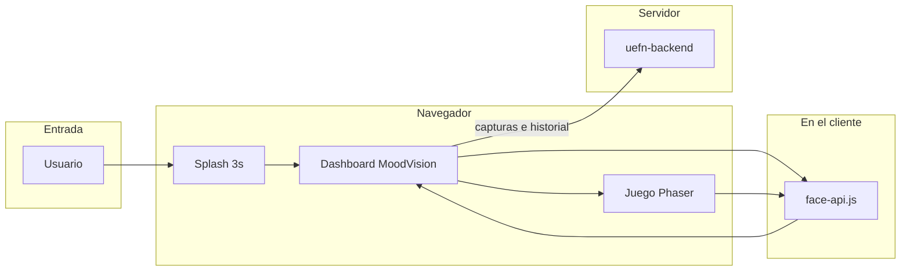
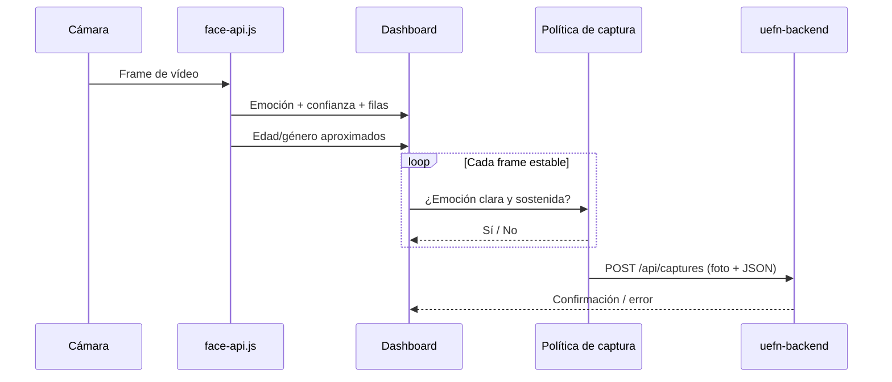
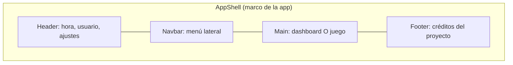
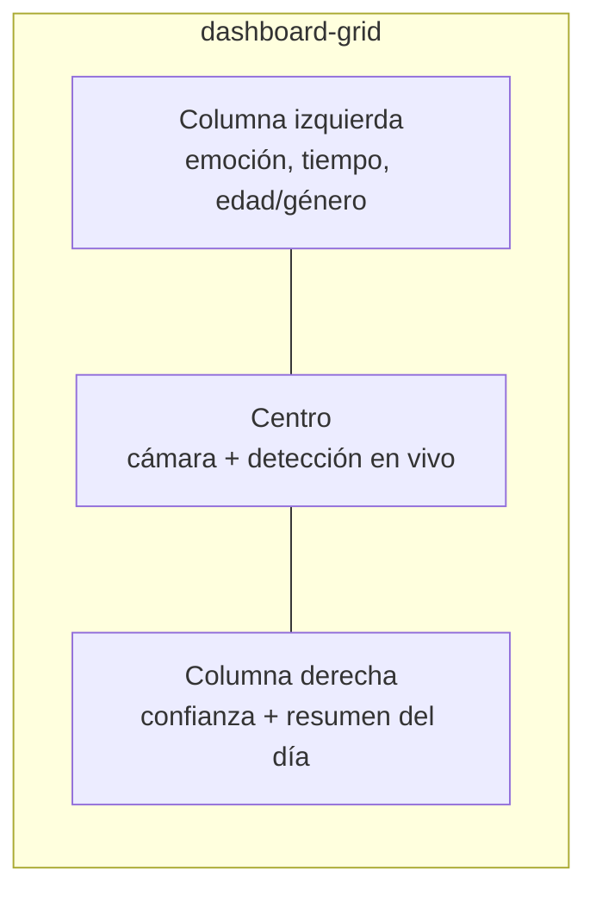
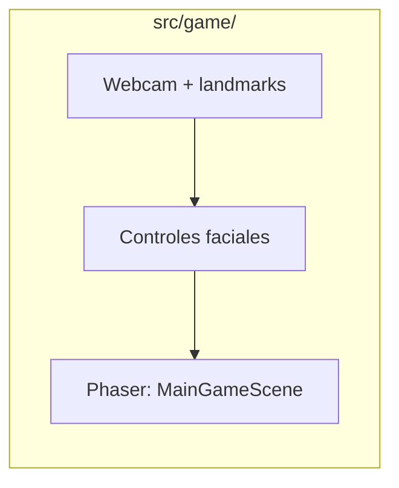
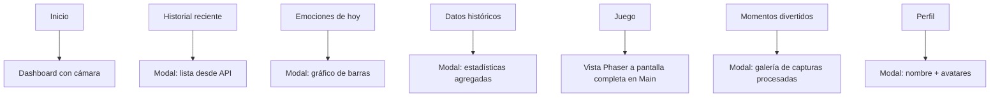
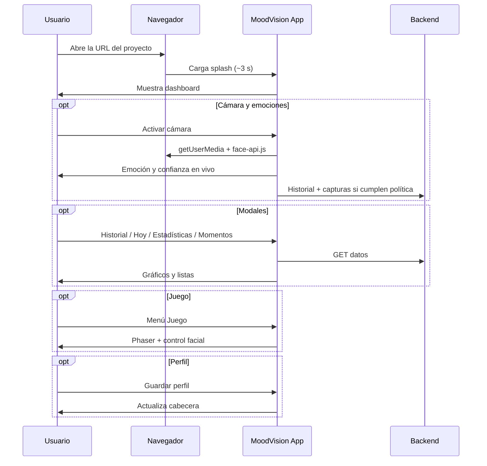
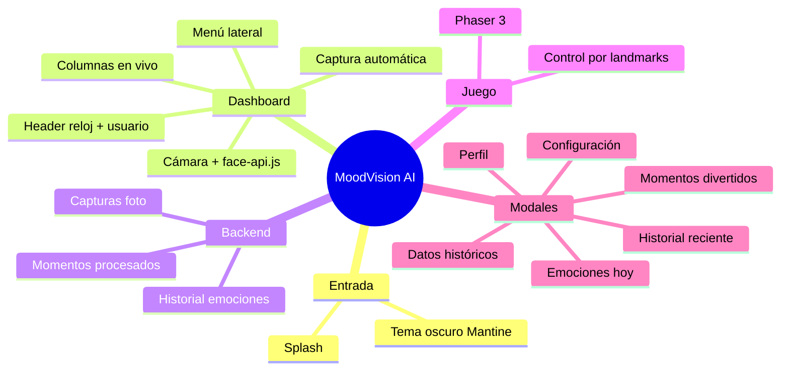

# MoodVision AI — Frontend (`uefn-frontend`)

Documento pensado para lectura **académica y clara** (nivel aproximado de un joven de ~15 años con interés en tecnología): qué es el repositorio, qué contiene, qué hace la interfaz y cómo fluye el uso.

---

## 1. Qué es este proyecto

|                      |                                                                                                                                                                                               |
| -------------------- | --------------------------------------------------------------------------------------------------------------------------------------------------------------------------------------------- |
| **Nombre comercial** | MoodVision AI                                                                                                                                                                                 |
| **Tipo**             | Aplicación web (SPA): un solo documento que React va actualizando sin recargar la página entera.                                                                                              |
| **Objetivo**         | Panel tipo **dashboard** para reconocimiento emocional con **cámara del navegador**, conexión a un **backend Node** (capturas e historial), un **minijuego** controlado con la cara y ventanas (modales) de estadísticas, historial y perfil. |
| **Idioma de la UI**  | Español (textos de pantalla).                                                                                                                                                                 |

Los parámetros de la app (URL del backend, límites de listados, umbrales de captura, ruta de modelos IA) están definidos en `src/config/appSettingsFields.js` y se pueden editar en el modal **Configuración** (rueda de ajustes), con valores por defecto desde `.env`.

> **Importante:** para ver emociones en vivo, historial y fotos guardadas necesitas el **backend** (`uefn-backend`) en marcha y los **modelos de face-api.js** descargados en `public/models/` (ver sección 8).

---

## 2. Idea general en un vistazo



- Primero ves una **pantalla de carga** con el nombre de la app.
- Luego entras al **dashboard**: barra superior, menú lateral, zona central con vídeo y tarjetas informativas.
- La cámara analiza tu rostro con **face-api.js** (emociones, edad/género aproximados).
- Si el backend está activo, la app **guarda capturas** y **historial** automáticamente cuando la emoción es clara y estable.
- Desde el menú puedes abrir el **juego** (estilo plataformas) y mover al personaje con gestos faciales.

---

## 2.1 Guía visual (carpeta `docs/`)

Las siguientes imágenes son **referencias ilustrativas** del aspecto general (tema oscuro, violeta, layout). No sustituyen al 100 % lo que verás en el navegador, pero ayudan a entender **splash**, **dashboard** y un **modal de perfil**. Para un informe académico puedes sustituirlas por capturas reales: ejecuta `npm run dev`, abre la app y usa la herramienta de capturas del sistema.

| Paso                      | Vista                                                          |
| ------------------------- | -------------------------------------------------------------- |
| Arranque (splash ~3 s)    |              |
| Dashboard principal       |  |
| Ejemplo de modal (Perfil) |                     |

Archivos en el repo: `docs/splash.png`, `docs/dashboard.png`, `docs/modal-perfil.png`.

---

## 3. Qué hay dentro del repositorio (estructura)

```text
uefn-frontend/
├── docs/                   # Guía visual: splash, dashboard, modal (PNG)
├── public/
│   └── models/             # Pesos de face-api.js (descargar con npm script)
├── scripts/
│   └── download-face-models.mjs   # Descarga automática de modelos IA
├── src/
│   ├── App.jsx             # Pantalla principal: shell + modales + grid + juego
│   ├── AppRoot.jsx         # Proveedor Mantine + splash inicial
│   ├── main.jsx            # Arranque de React
│   ├── styles.css          # Estilos globales del dashboard
│   ├── config/
│   │   └── appSettingsFields.js   # Catálogo de parámetros VITE_*
│   ├── context/
│   │   └── DashboardLiveSessionContext.jsx  # Estado en vivo (emoción, filas, perfil)
│   ├── components/
│   │   ├── dashboard/      # Cámara, columnas, modales
│   │   ├── game/           # Contenedor del juego en el menú
│   │   ├── head/           # Cabecera (reloj, usuario, ajustes)
│   │   └── menu/           # Menú lateral
│   ├── game/               # Minijuego Phaser + control facial
│   │   ├── GameMain.jsx
│   │   ├── scenes/
│   │   ├── faceDetection/
│   │   └── hooks/useFaceGameControls.js
│   ├── hooks/              # Cámara, historial, momentos divertidos, reloj
│   ├── data/               # Catálogo de emociones y avatares
│   ├── services/           # faceApi, emotionHistoryApi, funMomentsApi
│   └── utils/              # Captura automática, políticas, URLs de media
├── vite.config.js
└── package.json
```

### Herramientas principales (stack)

| Herramienta                                   | Rol (en pocas palabras)                                                                    |
| --------------------------------------------- | ------------------------------------------------------------------------------------------ |
| **React**                                     | Biblioteca para construir la interfaz con componentes.                                     |
| **Vite**                                      | Empaqueta y sirve el proyecto muy rápido en desarrollo.                                    |
| **Mantine**                                   | Componentes ya hechos (botones, modales, tipografía…).                                     |
| **Tabler Icons**                              | Iconos vectoriales del menú y cabecera.                                                    |
| **face-api.js**                               | Detecta rostro, expresiones y landmarks en el navegador.                                   |
| **Phaser 3**                                  | Motor del minijuego (escenas, física, sprites).                                            |
| **Recharts**                                  | Gráficos en modales (barras del día, estadísticas).                                         |
| **HTTPS en dev** (`@vitejs/plugin-basic-ssl`) | Ayuda a probar la **cámara** en red local (los navegadores suelen exigir contexto seguro). |

---

## 4. Cómo funciona la detección y la captura (nuevo)

Cuando activas la cámara, el componente `DashboardCameraStage` lee el vídeo en bucle y llama a `face-api.js`. Los resultados se muestran en las tarjetas laterales y, si cumples unas **reglas de calidad**, se envía una foto al backend.



| Concepto | Dónde está | Qué significa para el usuario |
| -------- | ---------- | ----------------------------- |
| **Emoción en vivo** | Tarjeta izquierda + lista derecha | Feliz, triste, neutral, etc., con % de confianza. |
| **Tiempo detectado** | Tarjeta izquierda | Cronómetro de sesión con la cámara activa (se pausa si pausas la detección). |
| **Captura automática** | `src/utils/emotionCapturePolicy.js` | Solo guarda si la emoción es fuerte, dominante y se mantiene unos segundos (configurable). |
| **Historial en backend** | `useEmotionHistoryRecorder` | Registra entradas mientras detectas (POST `/api/history`). |
| **Momentos divertidos** | Modal + `funMomentsApi.js` | Galería de fotos procesadas (GET `/api/captures/processed`). |

Umbrales editables (ejemplos): retardo antes de capturar, confianza mínima, diferencia entre 1.ª y 2.ª emoción. Ver `.env.example` y el modal **Configuración**.

---

## 5. Cómo se organiza la pantalla principal

No hay “varias páginas” con rutas distintas en el sentido clásico: es **una sola vista** con **zonas**, **ventanas emergentes** (modales) y una **vista de juego** que sustituye el grid del dashboard.



### Mapa del dashboard (vista Inicio)



| Zona          | Qué muestra                                                                                               | Notas                                         |
| ------------- | --------------------------------------------------------------------------------------------------------- | --------------------------------------------- |
| **Izquierda** | Emoción actual, tiempo de sesión, edad/género aproximados, barra de confianza, acciones                   | Datos **en vivo** desde face-api.js.          |
| **Centro**    | Vídeo de cámara + controles (activar, pausar detección, captura manual opcional)                          | Requiere HTTPS en desarrollo.                 |
| **Derecha**   | Lista de confianza por emoción + resumen del día (desde API si hay backend)                              | Hooks `useTodayEmotionSummary`, etc.          |

### Vista Juego (menú **Juego**)



- Motor **Phaser 3** con escena tipo plataformas (monedas, vidas, jefe).
- La **webcam** detecta puntos del rostro; `landmarksToControls` traduce gestos en movimiento, salto, sprint o disparo.
- Pantallas de inicio, calibración, victoria y game over en `GameUI.jsx`.

---

## 6. Menú lateral: qué abre cada ítem

El menú está definido en `src/components/menu/navItems.js`.



| Ícono (idea) | Entrada del menú        | Efecto principal                                        |
| ------------ | ----------------------- | ------------------------------------------------------- |
| Casa         | **Inicio**              | Cierra modales y muestra el dashboard.                  |
| Reloj        | **Historial reciente**  | Lista de emociones guardadas (backend).                 |
| Calendario   | **Emociones de hoy**  | Gráfico de barras del día (Recharts + API).             |
| Gráfico      | **Datos históricos**    | Resumen estadístico del historial.                      |
| Persona      | **Juego**               | Cambia el contenido central al minijuego Phaser.        |
| Cara feliz   | **Momentos divertidos** | Miniaturas de fotos procesadas; descarga opcional.    |
| Persona      | **Perfil**              | Editar nombre y avatar; **Guardar** actualiza cabecera. |

---

## 7. Otros puntos de interacción

| Elemento                        | Qué hace                                                                                                                |
| ------------------------------- | ----------------------------------------------------------------------------------------------------------------------- |
| **Rueda de ajustes** (cabecera) | Abre **Configuración**: URL del backend, límites de historial/momentos divertidos y umbrales de captura automática.   |
| **Burgers** (menú)              | En móvil abre/cierra el lateral; en escritorio colapsa/expande el navbar.                                               |

---

## 8. Cómo ejecutarlo en tu máquina

Necesitas **Node.js** (versión LTS recomendada) y npm.

### Paso 1 — Instalar y modelos de IA

```bash
cd uefn-frontend
npm install
npm run download-face-models
```

Esto descarga los pesos de **face-api.js** a `public/models/` (detector, expresiones, landmarks, etc.).

### Paso 2 — Variables de entorno

```bash
cp .env.example .env
```

| Variable (ejemplo) | Para qué sirve |
| ------------------ | -------------- |
| `VITE_BACKEND_URL` | URL del API Node (por defecto `http://localhost:3006`) |
| `VITE_FACE_API_MODELS_URL` | Carpeta de modelos (por defecto `/models`) |
| `VITE_EMOTION_HISTORY_RECENT_LIMIT` | Cuántas filas pide el historial reciente |
| `VITE_FUN_MOMENTS_PAGE_SIZE` | Fotos por página en momentos divertidos |
| `VITE_EMOTION_CAPTURE_*` | Umbrales de la captura automática |

### Paso 3 — Backend (recomendado)

En otra terminal, arranca **uefn-backend** en el puerto configurado. Sin backend verás la detección en pantalla, pero no se guardarán capturas ni historial.

### Paso 4 — Desarrollo

```bash
npm run dev
```

- El servidor usa **HTTPS** (certificado de desarrollo). El navegador puede avisar la primera vez: es normal en local.
- Escucha en **todas las interfaces** (`0.0.0.0`), útil si abres la app desde otro dispositivo en la misma red.

Otros comandos útiles:

| Comando                         | Para qué sirve                                                   |
| ------------------------------- | ---------------------------------------------------------------- |
| `npm run build`                 | Genera la versión optimizada en `dist/`.                         |
| `npm run preview`               | Previsualiza el build localmente.                                |
| `npm run lint`                  | Revisa el código con ESLint.                                     |
| `npm run download-face-models`  | Vuelve a bajar los modelos si faltan archivos en `public/models/`. |

Varias variables también se cambian desde el modal **Configuración** sin reiniciar el servidor (se guardan en `localStorage` vía `src/utils/appSettingsStore.js`).

---

## 9. Flujo del usuario (paso a paso)



En una frase: **entras → activas cámara → ves emociones en vivo → (con backend) se guardan datos → exploras modales o juegas con la cara → personalizas perfil.**

---

## 10. Créditos y contexto académico

En el **pie de página** de la app se indica que el proyecto de grado está desarrollado para **Domenica Miranda**, con mención al tema de reconocimiento de gestos faciales y videojuegos interactivos, y enlace a **Acertijo.dev**.

---

## 11. Resumen visual final



Ya existen referencias visuales en `docs/` (sección 2.1). Para sustituirlas por **capturas reales** (incluido el juego o el modal de momentos divertidos), guarda tus PNG en `docs/` y actualiza las rutas en esta sección.
