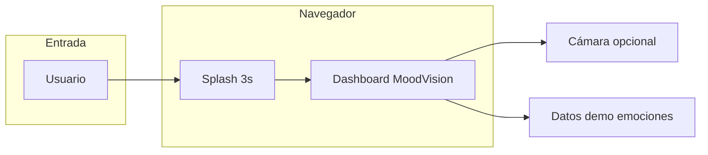
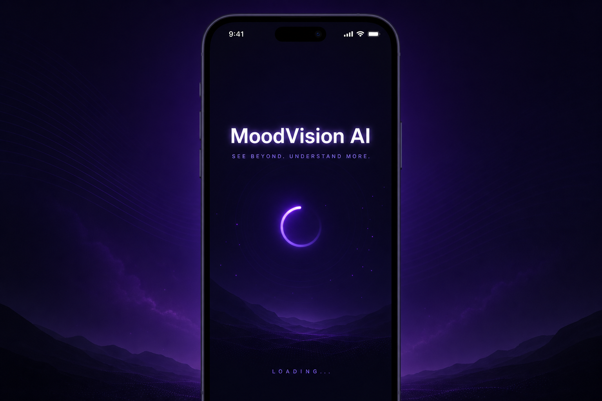
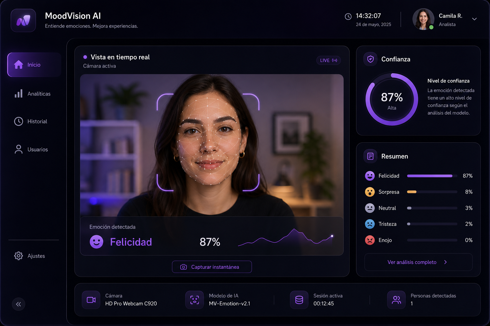
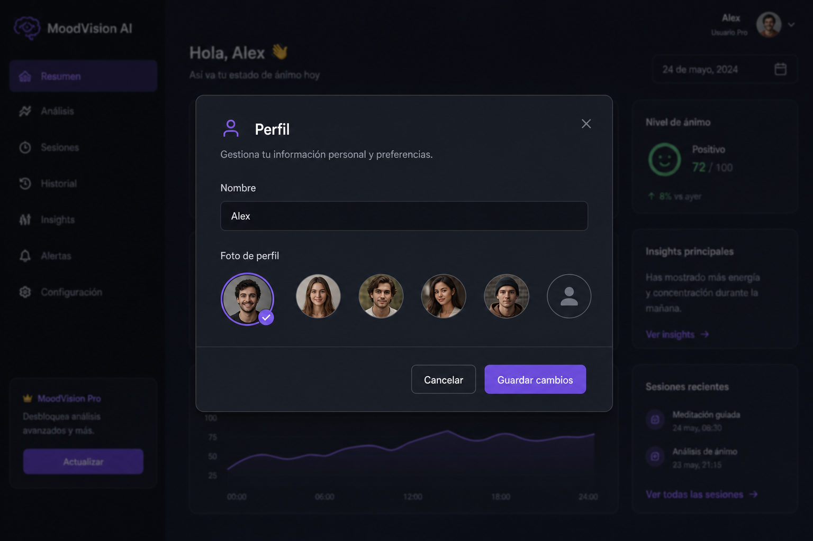
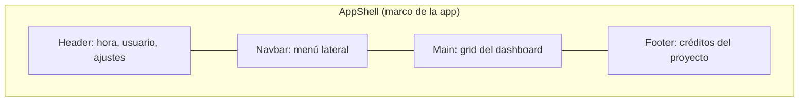
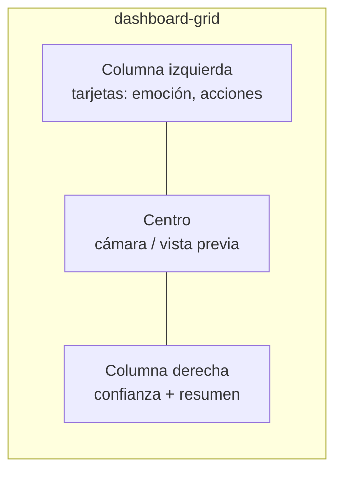
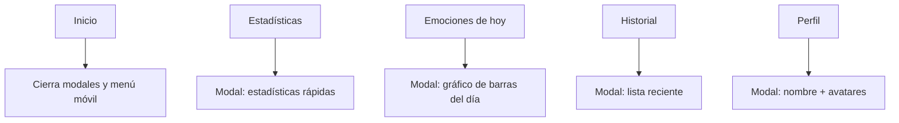
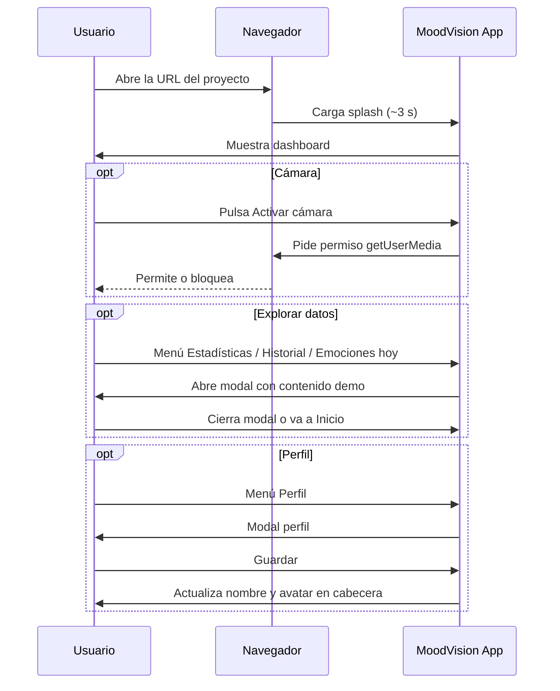
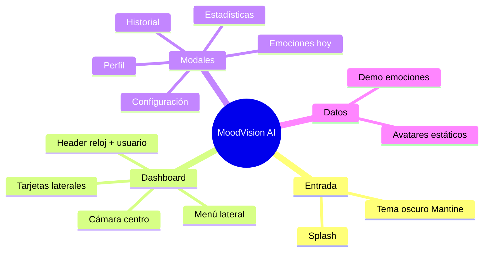

# MoodVision AI — Frontend (`uefn-frontend`)

Documento pensado para lectura **académica y clara** (nivel aproximado de un joven de ~15 años con interés en tecnología): qué es el repositorio, qué contiene, qué hace la interfaz y cómo fluye el uso.

---

## 1. Qué es este proyecto

|                      |                                                                                                                                                                                               |
| -------------------- | --------------------------------------------------------------------------------------------------------------------------------------------------------------------------------------------- |
| **Nombre comercial** | MoodVision AI                                                                                                                                                                                 |
| **Tipo**             | Aplicación web (SPA): un solo documento que React va actualizando sin recargar la página entera.                                                                                              |
| **Objetivo**         | Mostrar un **panel tipo dashboard** para reconocimiento emocional / estado de ánimo, con **cámara del navegador**, datos de ejemplo y ventanas (modales) de estadísticas, historial y perfil. |
| **Idioma de la UI**  | Español (textos de pantalla).                                                                                                                                                                 |

Los parámetros de la app (URL del backend, límites de listados, umbrales de captura) están definidos en `src/config/appSettingsFields.js` y se pueden editar en el modal **Configuración** (rueda de ajustes), con valores por defecto desde `.env`.

---

## 2. Idea general en un vistazo



- Primero ves una **pantalla de carga** con el nombre de la app.
- Luego entras al **dashboard**: barra superior, menú lateral, zona central con vídeo y tarjetas informativas.

---

## 2.1 Guía visual (carpeta `docs/`)

Las siguientes imágenes son **referencias ilustrativas** del aspecto general (tema oscuro, violeta, layout). No sustituyen al 100 % lo que verás en el navegador, pero ayudan a entender **splash**, **dashboard** y un **modal de perfil**. Para un informe académico puedes sustituirlas por capturas reales: ejecuta `npm run dev`, abre la app y usa la herramienta de capturas del sistema.

| Paso                      | Vista                                                          |
| ------------------------- | -------------------------------------------------------------- |
| Arranque (splash ~3 s)    |              |
| Dashboard principal       |  |
| Ejemplo de modal (Perfil) |                     |

Archivos en el repo: `docs/splash.png`, `docs/dashboard.png`, `docs/modal-perfil.png`.

---

## 3. Qué hay dentro del repositorio (estructura)

```text
uefn-frontend/
├── docs/                   # Guía visual: splash, dashboard, modal (PNG)
├── public/                 # Archivos estáticos (ej. avatares PNG)
├── scripts/                # Utilidades (ej. recorte de sprites de avatares)
├── src/
│   ├── App.jsx             # Pantalla principal: shell + modales + grid
│   ├── AppRoot.jsx         # Proveedor Mantine + splash inicial
│   ├── main.jsx            # Arranque de React
│   ├── styles.css          # Estilos globales / “look” del dashboard
│   ├── config/
│   │   └── appSettingsFields.js  # Catálogo de parámetros VITE_* (API, captura, listados)
│   ├── components/         # Piezas de interfaz reutilizables
│   ├── hooks/              # Lógica reutilizable (reloj, cámara)
│   ├── data/               # Datos de demostración (emociones, avatares)
│   └── services/           # Servicios (preparado para IA en cliente, etc.)
├── vite.config.js          # Configuración de Vite + HTTPS de desarrollo
└── package.json            # Dependencias y comandos npm
```

### Herramientas principales (stack)

| Herramienta                                   | Rol (en pocas palabras)                                                                    |
| --------------------------------------------- | ------------------------------------------------------------------------------------------ |
| **React**                                     | Biblioteca para construir la interfaz con componentes.                                     |
| **Vite**                                      | Empaqueta y sirve el proyecto muy rápido en desarrollo.                                    |
| **Mantine**                                   | Componentes ya hechos (botones, modales, tipografía…).                                     |
| **Tabler Icons**                              | Iconos vectoriales del menú y cabecera.                                                    |
| **HTTPS en dev** (`@vitejs/plugin-basic-ssl`) | Ayuda a probar la **cámara** en red local (los navegadores suelen exigir contexto seguro). |

En `package.json` también aparecen **face-api.js** y **Recharts** como dependencias; el código actual del dashboard se apoya sobre todo en **datos de ejemplo** y en la cámara vía `useCamera`. Esas librerías pueden usarse en evoluciones futuras (por ejemplo modelos en `/public/models`).

---

## 4. Cómo se organiza la pantalla principal

No hay “varias páginas” con rutas distintas: es **una sola vista** con **zonas** y **ventanas emergentes** (modales).



### Mapa del dashboard (contenido del `Main`)



| Zona          | Qué muestra                                                                                               | Notas                                         |
| ------------- | --------------------------------------------------------------------------------------------------------- | --------------------------------------------- |
| **Izquierda** | Emoción “actual”, tiempo simulado, fila edad/género, barra de confianza, interruptores y acciones rápidas | Datos de demo (`src/data/emotions.js`, etc.). |
| **Centro**    | Vídeo de cámara + mensajes si no hay permiso o no es HTTPS                                                | Botón “Activar cámara”.                       |
| **Derecha**   | Lista de confianza por emoción + bloque “Resumen” con cifras de ejemplo                                   | Componente `DashboardRightColumn`.            |

---

## 5. Menú lateral: qué abre cada ítem

El menú está definido en `src/components/menu/navItems.js`. Al pulsar un ítem suele **abrir un modal** o **volver a inicio**.



| Ícono (idea) | Entrada del menú     | Efecto principal                                        |
| ------------ | -------------------- | ------------------------------------------------------- |
| Casa         | **Inicio**           | Cierra todo y deja solo el dashboard.                   |
| Reloj        | **Historial**        | Lista de emociones recientes (demo).                    |
| Gráfico      | **Estadísticas**     | Gráfico circular + lista de porcentajes (demo).         |
| Calendario   | **Emociones de hoy** | Mini “gráfico de tendencia” del día (demo).             |
| Persona      | **Perfil**           | Editar nombre y avatar; **Guardar** actualiza cabecera. |

---

## 6. Otros puntos de interacción

| Elemento                        | Qué hace                                                                                                                |
| ------------------------------- | ----------------------------------------------------------------------------------------------------------------------- |
| **Rueda de ajustes** (cabecera) | Abre el modal **Configuración**: URL del backend, límites de historial/momentos divertidos y umbrales de captura automática (valores desde `.env`, editables y guardados en el navegador). |
| **Burgers** (menú)              | En móvil abre/cierra el lateral; en escritorio colapsa/expande el navbar.                                               |

---

## 7. Flujo del usuario (paso a paso)



En una frase: **entras → ves el panel → (opcional) activas cámara → navegas por modales desde el menú o ajustes → puedes personalizar perfil.**

---

## 8. Cómo ejecutarlo en tu máquina

Necesitas **Node.js** (versión LTS recomendada) y npm.

```bash
cd uefn-frontend
npm install
npm run dev
```

- El servidor de desarrollo usa **HTTPS** (certificado de desarrollo). El navegador puede mostrar una advertencia la primera vez: es normal en local.
- Por defecto el script escucha en **todas las interfaces** (`0.0.0.0`), útil si abres la app desde otro dispositivo en la misma red.

Otros comandos útiles:

| Comando                 | Para qué sirve                                                   |
| ----------------------- | ---------------------------------------------------------------- |
| `npm run build`         | Genera la versión optimizada en `dist/`.                         |
| `npm run preview`       | Previsualiza el build localmente.                                |
| `npm run lint`          | Revisa el código con ESLint.                                     |

Variables opcionales (Vite): copia `.env.example` a `.env` (prefijo `VITE_`). Lista completa y descripciones en `src/config/appSettingsFields.js`; varias también se cambian desde el modal **Configuración** sin reiniciar el servidor (se persisten en `localStorage` vía `src/utils/appSettingsStore.js`).

---

## 9. Créditos y contexto académico

En el **pie de página** de la app se indica que el proyecto de grado está desarrollado para **Domenica Miranda**, con mención al tema de reconocimiento de gestos faciales y videojuegos interactivos, y enlace a **Acertijo.dev**.

---

## 10. Resumen visual final



Ya existen referencias visuales en `docs/` (sección 2.1). Para sustituirlas por **capturas reales**, guarda tus PNG con el mismo nombre o actualiza las rutas en esta sección.
